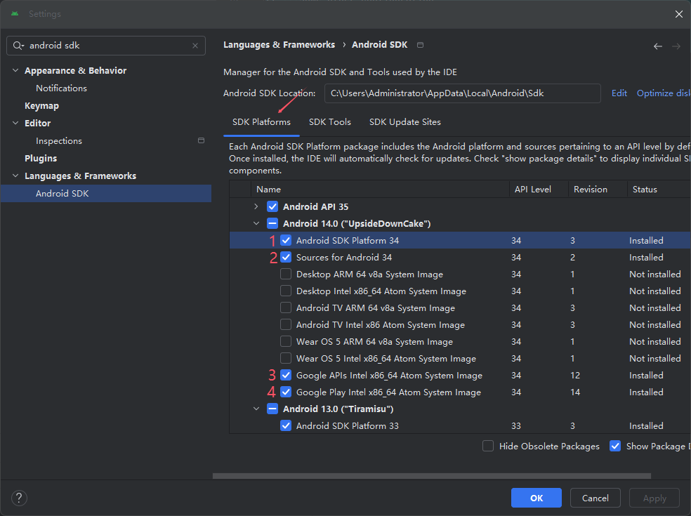

# react-native相关环境配置

## 配置概况
1. nodejs ------------ v20.17.0
2. react-native ------ v0.72.17
3. Android emulator -- 使用Android Studio内置的模拟器
4. adb --------------- v1.0.41
5. JDK --------------- 17

## nodejs
安装就不多说什么了，重要的是版本一定要正确。
```json
// package.json
{
// ...some other configuration
  "engines": {
    "node": ">=16"
  }
}
```

## react-native
如果初始化使用的是npx命令，就不需要先下载相关包，而是直接执行：
```bash
npx react-native@0.72 init demo --version 0.72
```

## Android Studio配置

### 1. 安装对应的SDK

